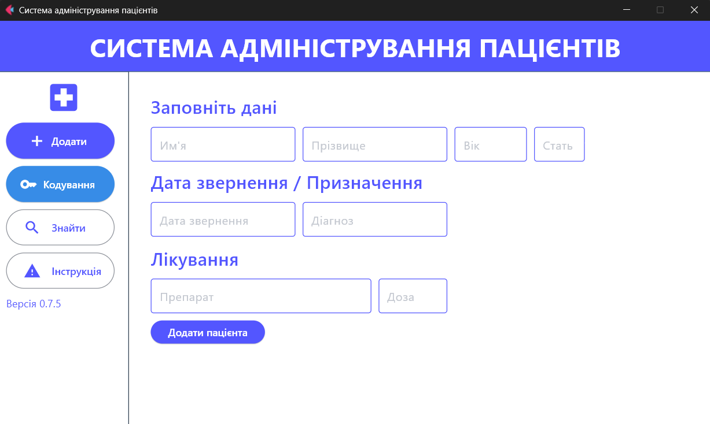
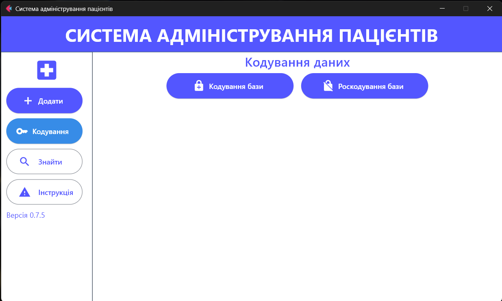

# Desktop Application for registration and storage of patient data

**Abstract**  
VERSION: 0.5.1 (06.09.2024)
A desktop application for specialized doctors in the field of psychiatry and medical psychology, for registration and storage of patient data with additional encryption and support for artificial intelligence.
The work was carried out within the framework of master's thesis by a student of the Faculty of Information Technologies, Priazovsky State Technical University.

**Supervisor:** Associate Professor Iryna Fedorivna Marchenko  
**Author:** Bachelor of Computer Science Oleksandr Serhiyovych Kior

### General

## Additional Education

- **“Understanding the Brain: The Neurobiology of Everyday Life”**  
  Peggy Mason, The University of Chicago
- **“Foundations of International Psychiatry”**  
  Greg Shields, Mahesh Jayaram, The University of Melbourne
- **Ukrainian Institute of Applied Psychology and Psychotherapy, Course “Gestalt, First Level”**

## Additional Tools

- **PubMed**
- **Cochrane Community**
- **UpToDate**

## Additional Literature

- **“Behave”**  
  Robert Sapolsky
- **“Introduction to Psychiatry”**  
  Donald W. Black, M.D. / Nancy C. Andreasen, M.D., Ph.D.
- **“Diagnostic and Statistical Manual of Mental Disorders, Fifth Edition”**  
  American Psychiatric Association

## Brief Program Description

The application is designed to assist in diagnosing psychiatric disorders. It includes a set of tools for conducting diagnostics, analyzing data, and providing treatment recommendations based on the results. The user interface is intuitive and easy to navigate.

## Interface Descriptions

The application includes several key interfaces:
* in developing *

## Usage Recommendations

* in developing *

## Legal Aspects

The application is intended for use by certified professionals only. All data obtained through the application must be stored and processed in compliance with data protection laws.
