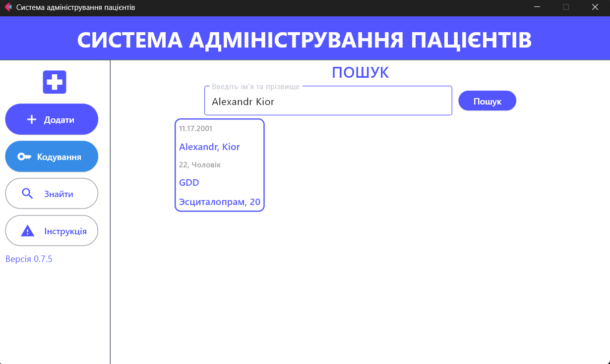

# Desktop Application for registration and storage of patient data

**Abstract**  
VERSION: 0.5.1 (06.09.2024)
A desktop application for specialized doctors in the field of psychiatry and medical psychology, for registration,storage of patient data with additional encryption and support.
The work was carried out within the framework of master's thesis by a student of the Faculty of Information Technologies, Priazovsky State Technical University.

**Supervisor:** NDA
**Author:** Bachelor of Computer Science Oleksandr Serhiyovych Kior

## Additional Education

- **“Understanding the Brain: The Neurobiology of Everyday Life”**  
  Peggy Mason, The University of Chicago
- **“Foundations of International Psychiatry”**  
  Greg Shields, Mahesh Jayaram, The University of Melbourne
- **Ukrainian Institute of Applied Psychology and Psychotherapy, Course “Gestalt, First Level”**

## Additional Tools

- **PubMed**
- **Cochrane Community**
- **UpToDate**

## Additional Literature

- **“Behave”**  
  Robert Sapolsky
- **“Introduction to Psychiatry”**  
  Donald W. Black, M.D. / Nancy C. Andreasen, M.D., Ph.D.
- **“Diagnostic and Statistical Manual of Mental Disorders, Fifth Edition”**  
  American Psychiatric Association

## Brief Program Description

The application is designed to assist in diagnosing psychiatric disorders. It includes a set of tools for conducting diagnostics, analyzing data, and providing treatment recommendations based on the results. The user interface is intuitive and easy to navigate.

## Interface Descriptions
The application includes several key interfaces:

## Add new patient to database

## Data encryption

## Encryption details

The code provided demonstrates how to implement data encryption and decryption using the cryptography library in Python. Here is a detailed explanation of how the encryption process works:

## Key Generation and Management:
- The encryption relies on a symmetric key generated by the Fernet class from the cryptography library. This key must be kept secret because it is required for both encryption and decryption.
- generate_key() function: This function generates a new encryption key using Fernet.generate_key(). The key is then saved to a file named secret.key in binary format.
- load_key() function: This function checks if the secret.key file exists. If it does not exist, it calls generate_key() to create one. It then reads the key from the file and returns it.
Data Encryption:

- encrypt_data() function:
This function starts by loading the encryption key using load_key().
It initializes a Fernet object with the retrieved key.
It then reads the contents of the patients.json file in binary mode. This file contains the plaintext data to be encrypted.
The fernet.encrypt() method is called with the file data, which produces the encrypted output.
The encrypted data is then written to a new file named patients_encrypted.json.
As a final step, the original patients.json file is cleared (emptied) by opening it in write mode without any content (i.e., pass statement), effectively removing the original data.

## Data Decryption:
- decrypt_data() function:
Similar to the encryption process, this function first loads the encryption key.
It checks for the existence of the patients_encrypted.json file. If the file is found, the function proceeds to read the encrypted data from it.
The data is then decrypted using the fernet.decrypt() method, which returns the original plaintext data.
Finally, the decrypted data is written back to the patients.json file, restoring it to its original state.

## Summary
In summary, the provided code securely encrypts and decrypts patient data stored in a JSON file using a symmetric key. The key is generated and stored securely, while operations are initiated through a user-friendly interface, enhancing ease of use while maintaining data security.

## Patient search

## Usage Recommendations

* in developing *

## Legal Aspects

The application is intended for use by certified professionals only. All data obtained through the application must be stored and processed in compliance with data protection laws.
